# 슈퍼SOL 보험 탭 — UI/UX 개선 구현

> 신한 슈퍼쏠(SOL) 앱 **보험 탭의 정보 구조·흐름·배치를 다시 설계하고, React로 실제 동작하게 만든 프로토타입.**
>
> 기존 보험 탭은 **"어떤 상품이 있는가"** 를 보여준다. 사용자의 실제 질문은
> **"내 보장에 지금 뭐가 비었는가"** 다. 이 구현은 진단 → 근거 → 행동을
> 한 줄로 잇고, **룩앤필은 기존 슈퍼쏠 그대로 둔 채 구조만 바꾼다.**

**룩앤필을 그대로 두는 것이 이 프로젝트의 제약이자 방법이다.** 9/11 사용자 테스트가
기존 앱과 이 구현의 **구조 비교**이기 때문에, "조금 더 예쁘게"는 측정을 오염시킨다.
색·타이포·라운드는 실제 앱 픽셀 실측 토큰에 고정되어 있고, 이탈하면 커밋이 막힌다.

스코프: 모바일웹 393×852 고정 · 목데이터(백엔드 없음) · 화면 20종 · 개선 아이디어 4개

---

## 3분 둘러보기

> 배포 URL 뒤에 아래 경로를 붙이면 바로 열립니다. 로그인·설치 없이 폰 브라우저에서 동작합니다.
> 데스크톱에서 열어도 `max-width: 393px` 폰 프레임으로 중앙에 뜹니다.

<!-- ⚠️ Vercel 연결 후 이 줄을 실제 URL로 교체 (CLAUDE.md 배포 항목) -->
**배포 URL: _(Vercel 연결 예정)_** · 로컬은 `npm run dev` → http://localhost:5173

| # | 화면 | 여기서 확인할 것 |
|---|---|---|
| 1 | **메인홈** `/` | 4개 과제가 전부 여기서 출발한다 — 실제 앱과 같은 진입점 |
| 2 | **금융 탭** `/finance` | 은행이 기본. 보험은 **상단 탭을 눌러야** 나온다 — 기존 앱의 진입 마찰을 일부러 남겼다 |
| 3 | **보험 메인** `/finance/insurance` | 보유 2건 기준 현황 + 2분할 행동 버튼. `?state=A` 로 0건 상태 전환 |
| 4 | **내 보험** `/finance/insurance/my` | 보유 계약 상세 |
| 5 | **진단 결과** `/diagnosis` | 보장 공백을 항목별로 — 접힘/펼침 |
| 6 | **브리핑** `/diagnosis/briefing` | 진단을 문장으로 요약 + 고정 CTA |
| 7 | **항목 상세** `/diagnosis/c-actual` | 왜 이 항목이 비었는지 |
| 8 | **에이전트 대화** `/agent` | 프리셋 고정 응답 — **실제 LLM을 붙이지 않았다**(테스트 통제 변수) |
| 9 | **상품 찾기** `/product/insurance` → `/product/insurance/list` | 카테고리 선택 후 목록 |
| 10 | **진행자 내보내기** `/export` | 과제별 기록 요약 · CSV/JSON 다운로드 |

계정 상태는 링크에 붙여 전환합니다 — `?state=B` 보유 2건 20대(기본) · `?state=A` 0건.
예: `/finance/insurance?state=A`

---

## 왜 이렇게 바꿨나

보험 탭에서 사용자가 막히는 지점은 상품 정보가 부족해서가 아니라, **"내 상태 → 무엇이 부족한가 → 그래서 뭘 하면 되는가"** 가
서로 다른 화면에 흩어져 있어서다. 20대 신규 진입자는 자기 보장 상태를 모르는 채로 상품 목록을 먼저 만난다.

그래서 개선 아이디어 4개를 각각 **하나의 흐름**으로 만들었다.

| 아이디어 | 바꾼 것 | 화면 |
|---|---|---|
| **1 · 상품 찾기** | 목록을 먼저 보여주지 않고 **조건을 고르게 한 뒤** 좁혀서 보여준다 | S2-A → S2-D → S6-A |
| **2 · 보험 메인** | 보유 건수에 따라 첫 화면이 달라진다 — 0건과 2건은 필요한 정보가 다르다 | S1-9 / S1-8 / S1-13 / S1-7 |
| **3 · 청구 흐름** | 카드 결제를 감지해 **청구 가능성을 먼저 알린다** — 사용자가 기억해서 찾아오지 않아도 되게 | S4-A → S5-A → S4-D → 완료 |
| **4 · 보장 진단** | 진단 결과를 브리핑 → 항목 상세 → 대화로 **파고들 수 있게** 계층화 | S3-D → S3-C → S3-E → S3-F |

첫 뷰포트(852px) 안에 각 화면의 핵심 행동이 들어오는 것을 검수 기준으로 삼았다
(S1은 2분할 버튼 · S2는 상품 3개 · S3은 첫 항목 · S4는 서류 박스).

---

## 화면

Figma 최종 UI 25장을 [`docs/figma-ref/`](docs/figma-ref/) 에 커밋해 두었습니다.
구현할 때 옆에 띄우고, 검수할 때 나란히 놓고 비교합니다. 아래는 흐름별 대표 화면입니다.

### 아이디어 2 · 보험 메인 — 보유 건수에 따라 첫 화면이 달라진다

0건인 사람과 2건인 사람에게 필요한 정보가 다릅니다. `?state=A|B` 로 전환합니다.

| 보유 2건 (기본) | 보유 0건 | 내 보험 | 기준 시트 |
|---|---|---|---|
| 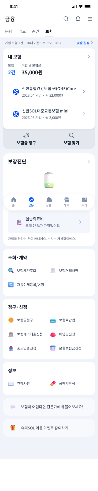 | 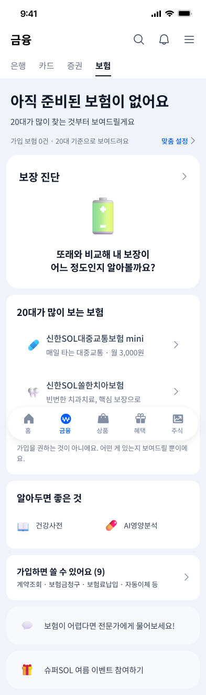 | 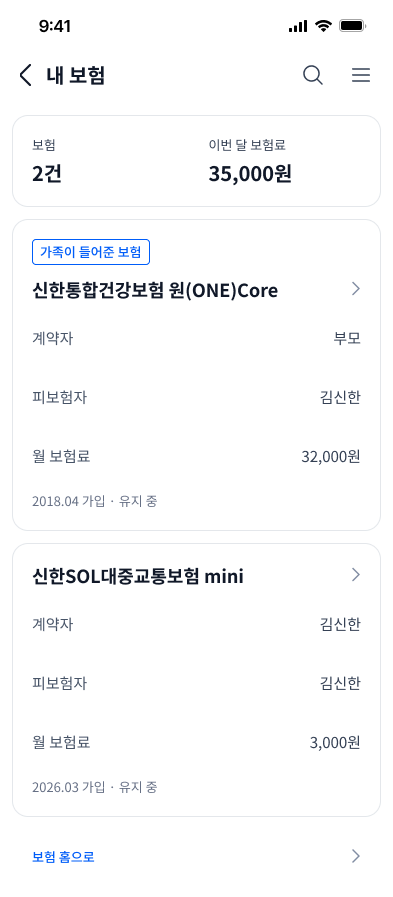 | 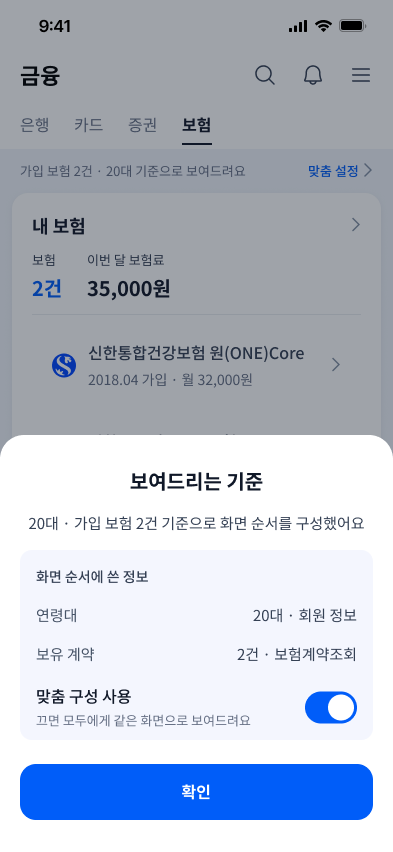 |

### 아이디어 4 · 보장 진단 — 브리핑에서 대화까지 파고든다

요약을 먼저 읽고, 궁금한 항목만 열고, 더 궁금하면 물어보는 계층 구조입니다.

| 브리핑 | 진단 결과 (접힘) | 진단 결과 (펼침) | 항목 상세 |
|---|---|---|---|
| 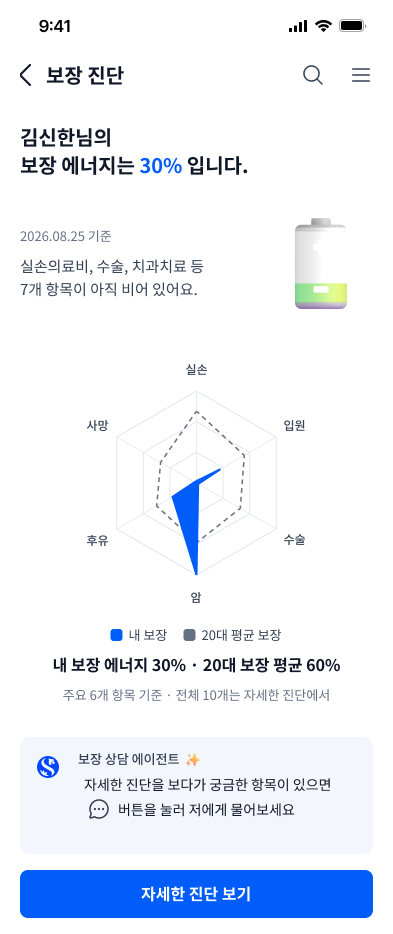 | 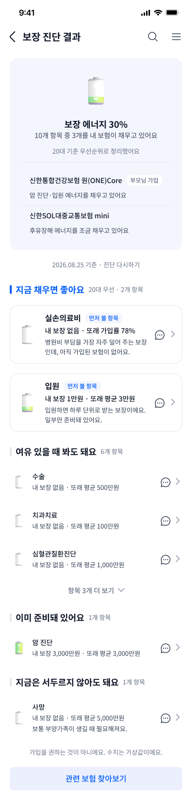 | 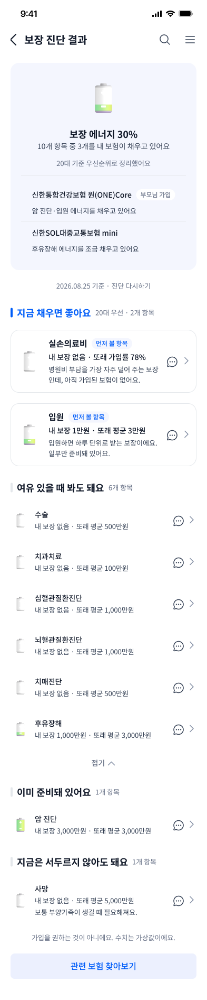 | 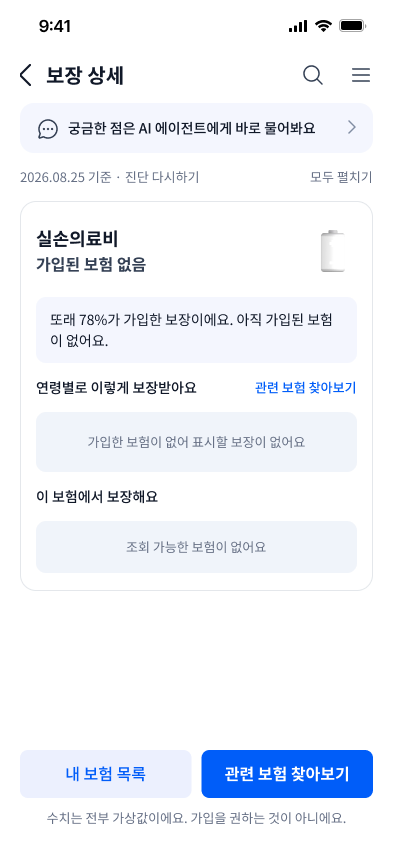 |

에이전트 대화는 **프리셋 고정 응답**입니다 — 실제 LLM을 붙이지 않았습니다.

| 대화 · 실손 | 대화 · 사망 |
|---|---|
| 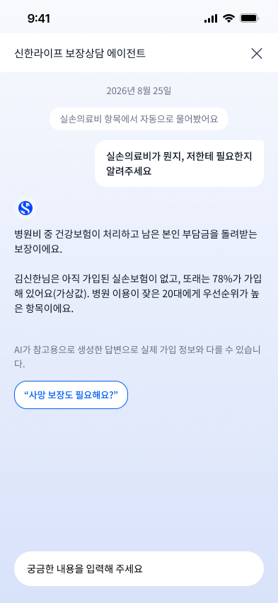 | 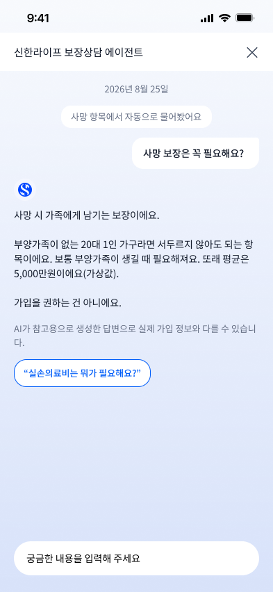 |

### 아이디어 3 · 청구 흐름 — 결제를 감지해 먼저 알린다

사용자가 기억해서 찾아오지 않아도 되게, 카드 결제 시점에 청구 가능성을 띄웁니다.

| 결제 감지 팝업 | 알림 설정 | 청구 절차 | 청구 완료 |
|---|---|---|---|
| 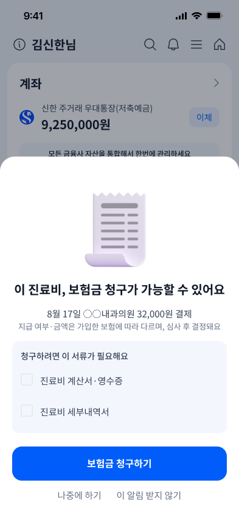 | 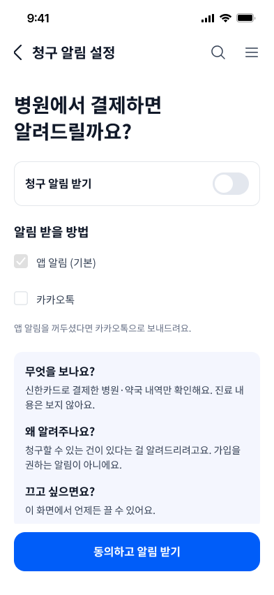 | 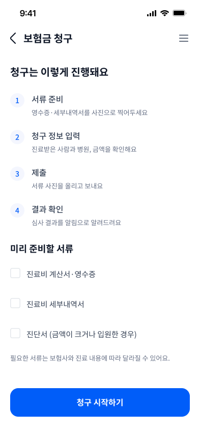 | 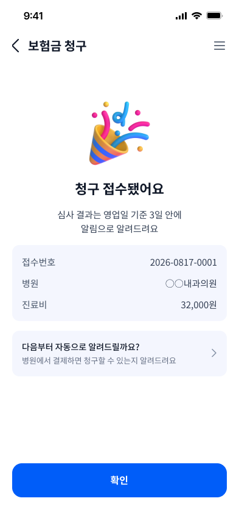 |

### 아이디어 1 · 상품 찾기 — 목록보다 조건을 먼저

| 상품 찾기 | 카테고리 선택 후 | 상품 상세 | 툴팁 열림 |
|---|---|---|---|
| 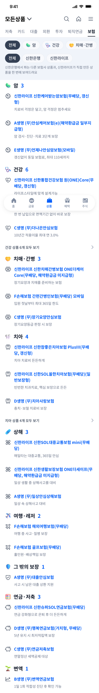 | 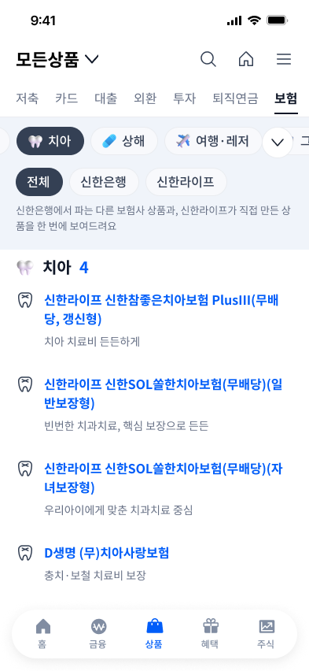 | 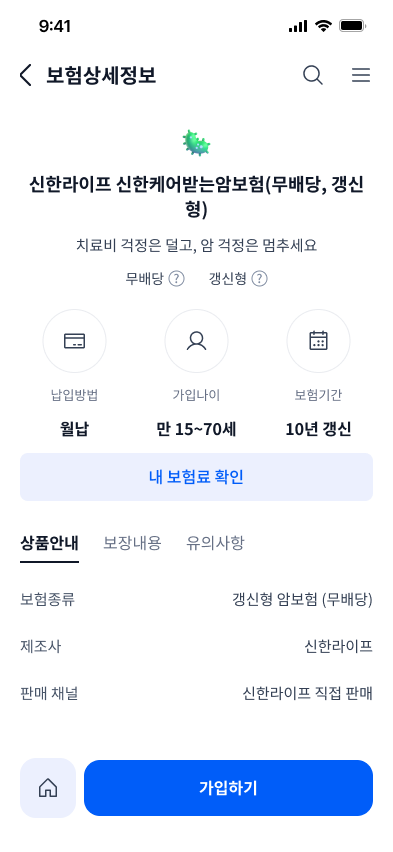 | 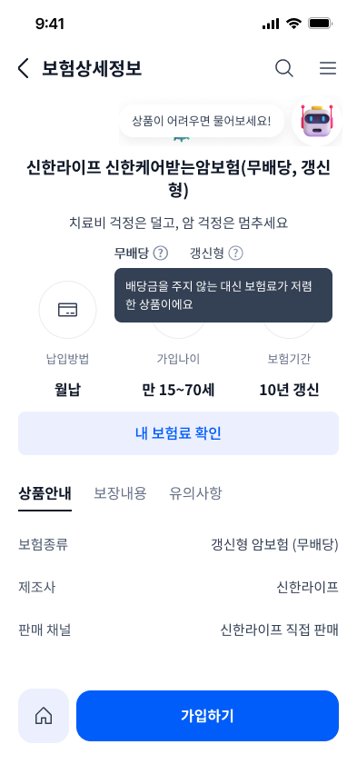 |

### 진입 경로 — 일부러 남긴 마찰

메인홈에서 보험까지 가는 길입니다. 금융 탭은 **은행이 기본**이고 보험은 상단 탭을 눌러야 나옵니다.
기존 앱의 진입 마찰을 그대로 뒀습니다 — 건너뛰면 비교가 오염됩니다.

| 메인홈 | 금융 · 은행 | 금융 · 카드 | 상품 · 발견 |
|---|---|---|---|
| 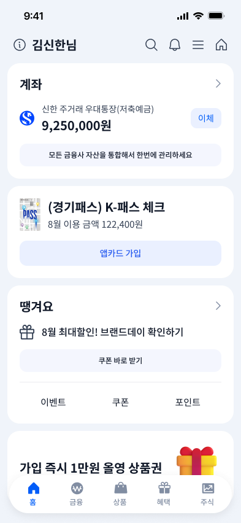 | 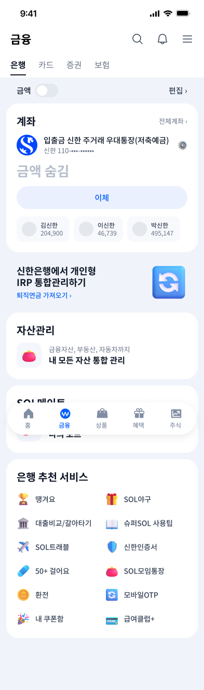 | 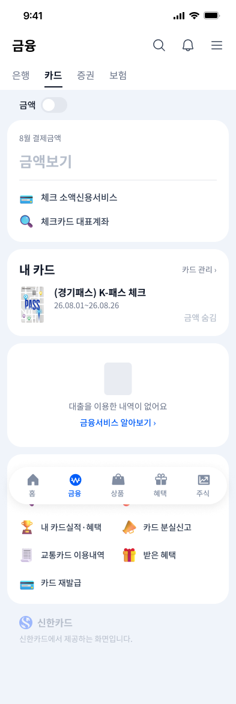 | 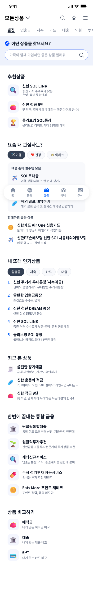 |

**픽셀 퍼펙트는 목표가 아닙니다.** Figma는 Noto Sans KR, 브라우저는 Pretendard라 1~2px 차이는 정상입니다.
검수 기준은 두 개뿐입니다 — ① DevTools로 찍은 값이 토큰과 일치하는가 ② 나란히 놓고 육안으로 등가인가.
픽셀 오버레이 비교는 하지 않습니다.

> 위 이미지는 **Figma 시안**입니다. 실제 구동 화면 캡처는 배포 후 교체합니다.

---

## 구조

```
src/
├── app/            # 라우터 · 계측 컨텍스트 · 목데이터 프로바이더
├── components/     # 공통 셸 — AppShell · Header · TopTabs · TabBar · Button · BottomCTA
├── pages/          # 화면 20종 (화면 1개 = 파일 1개 + CSS Module 1개)
├── data/           # 목데이터와 접근 층 — 화면은 useMock() 만 쓴다
├── lib/            # analytics · targetId · useTrack · useScrollTop
└── styles/         # tokens.css (색·라운드·간격) · typography.css (13단계)
```

설계에서 지키는 규칙 세 가지:

- **데이터 접근은 한 층으로 모은다** — 화면은 `useMock()` 만 호출합니다. 나중에 실데이터로 갈아끼울 때
  화면을 건드리지 않기 위해서입니다. 이 프로젝트는 **일회용 프로토타입이 아니라 확장을 전제로** 구조를 잡습니다.
- **토큰 밖의 값은 만들지 않는다** — `src/styles/tokens.css` 에 없는 색·라운드·폰트 크기를 쓰면
  `npm run lint:tokens` 가 커밋을 막습니다. Figma와 토큰이 충돌하면 **토큰이 이깁니다**
  (토큰은 실제 앱 픽셀 실측이고, Figma는 손으로 그린 산출물이기 때문).
- **계측 이름은 한 곳에서 만든다** — `targetId` 는 반드시 `src/lib/targetId.ts` 의 `tid()` 로.
  이름이 갈리면 집계가 안 됩니다.

---

## 계측

모든 탭을 `{taskId, targetId, screen, timestamp}` 로 남겨 localStorage 에 쌓고, `/export` 에서 CSV·JSON 으로 내려받습니다.

```tsx
<AppShell name="S1-보험메인" …>          // 화면 진입 자동 기록
const track = useTrack()
<button onClick={() => { track('현황카드'); … }}>   // 탭 기록
```

**계측은 비교 근거가 아니라 내부 진단용입니다.** 9/11 비교 지표는 **과제 성공률 + 주관 평가 2종**이고,
클릭 수·소요 시간은 비교에서 뺐습니다 — 기존 슈퍼쏠은 코드를 건드릴 수 없어 자동 계측이 안 되는데
한쪽만 기계로 세면 그 차이가 우리 쪽에 유리한 편향이 되기 때문입니다. 쌓인 기록은
**"어디서 헤맸나"** 를 보는 데만 씁니다.

화면을 추가하면 계측도 같이 붙입니다 — 나중에 소급하면 화면을 전부 다시 열어야 합니다.

---

## 실행 방법

```bash
git clone https://github.com/youngjun1227/supersol-insurance-app
cd supersol-insurance-app
npm install
git config core.hooksPath .githooks   # 커밋·푸시 훅 (1회)

npm run dev        # http://localhost:5173 — 폰에서는 터미널의 Network 주소로 접속
```

검사·빌드:

```bash
npm run typecheck      # 타입 검사
npm run test           # 전 라우트 렌더 스모크 테스트
npm run lint:tokens    # 토큰 이탈 검사 (pre-commit 에서 자동 실행)
npm run check:mock     # 목데이터 정합성
npm run build          # 타입체크 + 프로덕션 빌드
```

디자인 레포에서 에셋(3D 일러스트·로고) 가져오기 — 형제 폴더에 `../SOL_UI:UX_Redesign` 전제:

```bash
npm run sync:assets
```

---

## 기술 스택

| 영역 | 사용 기술 |
|---|---|
| 프론트엔드 | React 19 · TypeScript · Vite · CSS Modules |
| 라우팅 | react-router-dom |
| 아이콘 | @phosphor-icons/react (`weight="regular"` · 탭바만 `fill`) · 3D 일러스트는 PNG |
| 폰트 | Pretendard (웹폰트 400/500/700) |
| 데이터 | 목데이터 정적 모듈 — **백엔드 없음** |
| 배포 | Vercel 정적 배포 (main=프로덕션 / PR=프리뷰) · PWA 메타로 홈 화면 전체화면 실행 |

**라이브러리를 일부러 최소로 유지합니다** — 상태관리·UI 킷·애니메이션 라이브러리를 넣지 않았습니다.
룩앤필을 기존 앱에 맞춰야 하는 프로젝트라 라이브러리 기본 스타일이 들어오는 순간 토큰 규율이 무너집니다.

---

## 개발 문서

| 문서 | 내용 |
|---|---|
| [docs/디자인스펙.md](docs/디자인스펙.md) | **구현의 단일 기준** — 색·타이포·라운드·간격·컴포넌트 스펙 |
| [docs/디자인변경로그.md](docs/디자인변경로그.md) | 스펙 이후의 변경 — **충돌 시 이쪽이 최신** |
| [docs/아이콘-매핑.md](docs/아이콘-매핑.md) | Figma 아이콘 → Phosphor 대응표 |
| [docs/온보딩.md](docs/온보딩.md) | 팀 합류 후 처음 30분 |
| [CONTRIBUTING.md](CONTRIBUTING.md) | 브랜치·PR·커밋 규칙, 역할 분담 |
| [docs/운영/](docs/운영/) | 9/11 리허설 체크리스트 · 9/20 발표 QA |

디자인 원본(Figma·리서치·토큰)은 별도 저장소입니다 —
[supersol-insurance-redesign](https://github.com/youngjun1227/supersol-insurance-redesign).
**디자인이 바뀌면 그쪽이 원본이고, 이 저장소가 따라갑니다.**

---

## 유의사항

- **학습·연구 목적의 UI/UX 개선 구현이며, 신한은행·신한카드와 무관합니다.** 공식 제품이 아닙니다.
- 화면의 모든 데이터는 **목데이터**입니다. 인물명·전화번호·타사 상품명은 전부 가명이며
  (김신한 · 010-0000-0000 · A생명 · D생명), 실제 상품·요율·보장 내용이 아닙니다.
- 에이전트 대화는 **프리셋 고정 응답**입니다 — 실제 LLM을 붙이지 않았습니다.
  사용자 테스트에서 모델 응답 편차가 통제 변수를 흔들기 때문입니다.
- 신한 CI 블루(`#0046FF`)는 로고 표시에만 씁니다.
