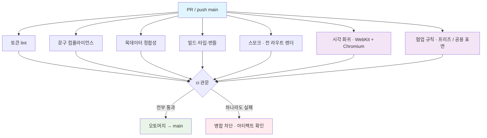

## 왜 2.0 인가

2026-09-04 부터 **PR 승인이 필수가 아니다** (오토머지 · 필수 승인 0 — CLAUDE.md 브랜치·CI 확정).
그전까지 CI 는 코드 위생만 보고, "figma-ref 와 같은가" · "아이폰에서 깨지지 않는가"는 팀장 승인이 봤다.
승인이 빠졌으니 그 둘을 CI 가 맡아야 한다. 1.x 의 5단계는 그대로 두고 3단계를 더한다.

이 문서는 **무엇을 막는가**를 적는다. 어떻게(문법·버전)는 `.github/workflows/ci.yml` 이 갖는다.
바꿀 때는 이 문서를 먼저 고치고 워크플로를 따라 고친다.

## 개요

| | |
|---|---|
| **목적** | main 에 들어가는 모든 커밋이 ① 규칙(토큰·문구·목데이터) ② 빌드 ③ 전 라우트 렌더 ④ **승인된 화면 기준선과 시각적으로 같음** ⑤ **협업 규칙(프리즈·공용 표면)** 을 만족하게 한다 |
| **트리거** | PR → main · push → main |
| **대상 환경** | 정적 빌드 1벌. 배포는 Vercel 이 별도로 한다 (CI 는 배포하지 않음) |
| **관문** | `ci` 라는 이름의 job 하나 — 브랜치 보호의 required check 는 이 이름 하나다. 앞 job 이 늘어도 이름은 안 바뀐다 |

## 실행 흐름



7개 job 은 서로 독립 — 병렬. 관문만 전부를 기다린다.

## Job 과 의존

| Job | 막는 것 | 근거 사고 | 의존 | 실행 환경 |
|---|---|---|---|---|
| 토큰 lint | 토큰 밖 hex · 직접 font-size/radius · 라이프 색 · `100vh` | 스펙 §1~3 | 없음 | Node 20 |
| 문구 컴플라이언스 | 금칙어("개선안"·"MVP"…) · 실명 · 실번호 · Claude 트레일러 | CLAUDE.md 문구·커밋 규칙 | 없음 | Node 20 |
| 목데이터 정합성 | `mock.ts` 가 원본 문서(상품 26 · 보장 10 · 티어 4)와 어긋남 | "건강 7" 사고 | 없음 | Node 20 |
| 빌드·타입·번들 | 타입 오류 · 빌드 실패 · gzip JS 200KB / CSS 40KB 초과 | 아이콘 동적 조회 5.2MB 사고 | 없음 | Node 20 |
| 스모크 | 라우트 31벌이 throw · 콘솔 에러 없이 뜨는가 · 목록↔App.tsx 라우트 수 대조 | #81 | 없음 | Node 22 (jsdom) |
| **시각 회귀** (신설) | figma-ref 대상 화면의 렌더가 **승인된 기준선**과 다름 | 탭바 위치·시트 패딩(#150·#151) — CI 는 조용했다 | 없음 | Playwright 컨테이너 |
| **협업 규칙** (신설) | ① 9/10 이후 `hotfix` 라벨 없는 PR ② 팀장 아닌 사람이 공용 표면을 라벨 없이 수정 | 프리즈 · 공용 표면 소유 규칙 | 없음 | 셸만 |
| ci | 위 7개 결과 취합 | required check 이름 유지 | 전부 | 셸만 |

## 요구사항

### 기능

| ID | 요구 | 우선 | 합격 기준 |
|---|---|---|---|
| REQ-001 | 1.x 의 5개 검사는 그대로 유지한다 | High | 기존 스크립트 5개가 그대로 호출된다 |
| REQ-002 | 시각 회귀는 **WebKit 을 P0**, Chromium 을 P1 로 돈다 | High | 두 엔진 각각 기준선을 갖고, 둘 다 관문에 포함된다 |
| REQ-003 | 뷰포트는 **393×852 · DPR 2** 하나 | High | 다른 폭은 찍지 않는다 (스펙 §0 고정 뷰포트) |
| REQ-004 | 촬영 대상 = **figma-ref 가 있는 화면 전부** + 쿼리 상태 변형 | High | `docs/figma-ref/*.png` 25장 ↔ 촬영 목록이 1:1 로 대응하고, 대응 검사가 목록 누락을 잡는다 |
| REQ-005 | 기준선은 저장소 안에 두고, **기준선 갱신은 PR 안에서 함께 커밋**된다 | High | 화면을 바꾼 PR 은 기준선 PNG 도 바뀐다. 기준선 없이 화면만 바뀌면 실패 |
| REQ-006 | 기준선은 **CI 와 같은 컨테이너에서만** 생성한다 | High | 로컬 맥에서 찍은 PNG 는 폰트 렌더가 달라 즉시 실패한다 — 갱신 job 이 CI 에서 찍어 PR 브랜치에 커밋 |
| REQ-007 | 실패 시 expected / actual / diff 3장을 **아티팩트로 남긴다** | High | 실패한 run 에서 다운로드 가능. 보고서 없는 실패는 없다 |
| REQ-008 | 동적 요소는 고정한다 — 스플래시 대기, 웹폰트 로드 대기, 애니메이션 끔 | High | 같은 커밋을 두 번 돌리면 diff 0 |
| REQ-009 | 허용 오차: `maxDiffPixels 100` (절대값) | Medium | 비율(0.5%)은 1600px 짜리 긴 페이지에서 아이콘 22→28 같은 작은 회귀를 놓친다. 컨테이너 렌더는 결정적이라 정상 흔들림 ≈ 0 |
| REQ-010 | 9/10 00:00 KST 이후의 PR 은 `hotfix` 라벨이 있어야 통과 | High | 라벨 없으면 협업 규칙 job 실패 |
| REQ-011 | 팀장(`youngjun1227`) 이 아닌 작성자의 PR 이 공용 표면을 바꾸면 `공용-허용` 라벨이 있어야 통과 | Medium | 공용 표면 = `src/components/**` · `src/app/**` · `src/pages/Home.tsx` · `src/data/**` · `src/styles/tokens.css` · `src/lib/targetId.ts` |
| REQ-012 | 관문 job 이름은 `ci` 로 고정 | High | 브랜치 보호 설정을 건드리지 않는다 |
| REQ-013 | paths 필터를 두지 않는다 | High | 필터에 걸려 실행이 안 되면 required check 가 영원히 pending (Ventry 교훈) |

### 성능

| ID | 지표 | 목표 | 측정 |
|---|---|---|---|
| PERF-001 | 관문까지 총 소요 | **8분 이내** | run 의 duration. 시각 회귀가 가장 길다 (컨테이너 pull + 빌드 + 25장×2엔진) |
| PERF-002 | 시각 회귀 오탐률 | **0** | 같은 커밋 재실행에서 diff 발생 시 REQ-008 위반으로 취급 |
| PERF-003 | 저장소 증가 | 기준선 1벌 ≤ 10MB | 25장 × 2엔진 × ~150KB. LFS 는 안 쓴다 — `ponytail:` 9/20 까지 갱신 횟수가 적다. 100MB 넘으면 LFS |

## 입력 / 출력

```yaml
# 입력 — 저장소 내용 외에 필요한 것
네트워크: cdn.jsdelivr.net (Pretendard 웹폰트)  # 막히면 REQ-008 이 깨진다 → 폰트 로드 실패는 실패로 처리
라벨: hotfix · 공용-허용 · 기준선-갱신
비밀: 없음 (GITHUB_TOKEN 만 — 기준선 갱신 커밋 push 용)

# 출력
아티팩트: visual-report-{engine} (실패 시) — expected/actual/diff PNG + HTML 보고서
커밋: 기준선 갱신 job 이 PR 브랜치에 "기준선 갱신 — <화면>" 커밋 1개
```

## 시각 회귀 상세

### 브라우저 매트릭스 (cross-browser-testing 스킬 기준)

"분석 데이터"는 9/11 참가자 기기다 — **전원 아이폰(사파리 또는 홈 화면 PWA)**. 팀 개발 환경이 크로미움.

| 엔진 | 등급 | 이유 | 실행 |
|---|---|---|---|
| WebKit (iPhone 에뮬레이션 393×852, DPR 2) | **P0** | 참가자 100% · 오늘 잡은 버그 3개 전부 iOS 전용 | 모든 PR |
| Chromium (같은 뷰포트) | P1 | 개발 환경 · Vercel 프리뷰 확인 환경 | 모든 PR (비용이 작아 P1 도 매번) |
| Firefox | 제외 | 참가자·팀원 0 | — |

⚠️ **엔진 ≠ 브랜드.** Playwright WebKit 은 iOS 사파리가 아니다. `env(safe-area-inset-*)` 은 0 이고,
`-webkit-overflow-scrolling` 안의 fixed 버그(#146)나 홈 인디케이터 이중 계산(#150)은 **재현되지 않는다**.
이 job 이 잡는 건 "기준선 대비 회귀"이지 "iOS 에서 맞는가"가 아니다. iOS 전용 확인은 PR 템플릿의
**폰 실기기 체크**가 계속 맡는다 — 다음 표 참고.

### 무엇을 누가 잡나

| 결함 | 잡는 곳 |
|---|---|
| 토큰 밖 값 · 문구 · 목데이터 | 1.x 검사 |
| 화면이 안 뜸 · 콘솔 에러 | 스모크 |
| 레이아웃·간격·크기가 기준선과 달라짐 (예: 탭바 아이콘 22→28) | **시각 회귀** |
| figma-ref 와 다름 | **기준선 갱신 시 사람이 본다** — 기준선 PNG 가 곧 승인된 화면. 갱신 PR 의 PNG diff 를 팀장이 main 에서 사후 확인 |
| iOS 에서만 깨짐 (safe-area · fixed · 100vh) | **폰 실기기** — CI 밖. PR 템플릿 체크박스 |

### 동적 요소 고정 (REQ-008)

| 요소 | 처리 |
|---|---|
| 스플래시 (`SPLASH_MS` 1200) | 스플래시 텍스트가 사라질 때까지 대기 |
| Pretendard 웹폰트 | `document.fonts.ready` 대기 · 로드 실패면 테스트 실패 (통과시키면 시스템 폰트로 찍혀 기준선이 오염된다) |
| CSS 애니메이션·트랜지션 (시트 slideUp 등) | `animations: 'disabled'` |
| 시계·배터리 (시연용 iOS 모사 이미지) | 정적 이미지라 고정 불필요 |
| `/export` (localStorage 시각) | 촬영 대상 아님 — figma-ref 없음 |
| 3D PNG 에셋 | 저장소 안 정적 파일 — 고정 불필요 |

### 기준선 갱신 흐름

```
화면을 바꿈 → PR → 시각 회귀 실패 (예상된 실패)
→ PR 에 라벨 `기준선-갱신` → 갱신 job 이 CI 컨테이너에서 다시 찍어 PR 브랜치에 커밋
→ 시각 회귀 재실행 통과 → 오토머지
→ 팀장이 main 의 기준선 PNG diff 를 보고 figma-ref 와 대조 (사후) → 어긋나면 이슈
```

라벨은 **의도한 변경임을 선언**하는 행위다. 라벨 없이 실패하면 회귀로 취급한다.

## 오류 처리

| 오류 | 응답 | 복구 |
|---|---|---|
| 1.x 검사 실패 | 관문 실패 · 로그에 위반 위치 | 코드 수정 |
| 시각 diff 발생 | 관문 실패 · 아티팩트 3장 | 의도한 변경이면 `기준선-갱신` 라벨 · 아니면 코드 수정 |
| 기준선 없음 (새 화면) | 관문 실패 · "기준선 없음" 로그 | `기준선-갱신` 라벨 |
| 웹폰트 CDN 실패 | 시각 회귀 실패 (통과시키지 않음) | 재실행 |
| 프리즈 위반 | 협업 규칙 실패 · 로그에 "9/10 이후 hotfix 라벨 필요" | 라벨 또는 9/11 뒤로 |
| 공용 표면 위반 | 협업 규칙 실패 · 로그에 바뀐 공용 파일 목록 | 팀장이 `공용-허용` 라벨 또는 팀장 브랜치로 이관 |

## 품질 관문

| 관문 | 기준 | 우회 |
|---|---|---|
| 규칙 (토큰·문구·목데이터) | 위반 0 | 없음 |
| 빌드 | 타입 0 오류 · 번들 상한 | 없음 |
| 렌더 | 31 라우트 에러 0 | 없음 |
| 시각 | diff ≤ 오차 · 기준선 존재 | `기준선-갱신` 라벨 (= 의도 선언) |
| 프리즈 | 9/10 이전 또는 `hotfix` | 라벨 |
| 공용 표면 | 팀장 작성 또는 `공용-허용` | 라벨 (팀장만 붙인다는 약속 — GitHub 은 라벨 권한을 나누지 못한다) |

## 실행 제약

- **타임아웃**: job 당 15분 · 시각 회귀 20분
- **동시성**: 같은 ref 의 이전 run 취소 (`cancel-in-progress`)
- **러너**: ubuntu-latest · 시각 회귀만 `mcr.microsoft.com/playwright` 컨테이너 (버전 = `@playwright/test` 버전)
- **권한**: 읽기 기본 · 기준선 갱신 job 만 `contents: write`
- **네트워크**: npm registry · jsdelivr (폰트)

## 엣지 케이스

| 상황 | 기대 동작 | 확인 |
|---|---|---|
| 라우트를 추가했는데 촬영 목록에 안 넣음 | figma-ref↔목록 대조는 통과(figma-ref 도 없으므로) · 스모크의 라우트 수 대조가 잡음 | 스모크 실패 |
| figma-ref PNG 를 추가했는데 촬영 목록에 안 넣음 | 시각 회귀 실패 "figma-ref 25 ≠ 목록 24" | 대조 검사 |
| 기준선만 바꾸고 코드는 안 바꿈 | 통과 (기준선이 곧 승인) — 팀장 사후 확인 대상 | main PNG diff |
| 오토머지 켠 뒤 push | 새 run 이 다시 돈다 · 머지는 새 run 통과 후 | GitHub 동작 |
| 팀장 PR 이 공용 표면 수정 | 통과 | 작성자 조건 |
| main 이 앞서가 브랜치가 뒤처짐 | strict 규칙으로 머지 보류 · `Update branch` 후 재실행 | GitHub 동작 |
| 9/10 이후 팀장 PR (hotfix 라벨 없음) | 실패 — 팀장도 예외 없음 | 프리즈 검사 |

## 검증 기준

- **VLD-001**: 같은 커밋으로 시각 회귀를 2회 실행해 diff 0
- **VLD-002**: 탭바 아이콘 size 를 28→22 로 바꾼 커밋이 WebKit·Chromium 둘 다 실패
- **VLD-003**: `docs/figma-ref` 에 PNG 1장을 추가만 하면 대조 검사가 실패
- **VLD-004**: `hotfix` 라벨 없는 PR 을 날짜 강제로 9/10 이후로 두면 실패
- **VLD-005**: 관문 run 총 시간 8분 이내

## 변경 관리

1. 이 문서를 먼저 고친다
2. 워크플로·테스트를 따라 고친다
3. VLD-001~005 를 PR 에서 확인한다
4. 브랜치 보호의 required check 이름(`ci`)은 바꾸지 않는다

| 버전 | 날짜 | 변경 | 작성 |
|---|---|---|---|
| 1.0 | 2026-08-26 | 토큰·문구·목데이터·빌드 4단계 | 팀장 |
| 1.1 | 2026-08-29 | 스모크(전 라우트 렌더) 추가 (#81) | 팀장 |
| 2.0 | 2026-09-04 | 승인 필수 해제에 맞춰 시각 회귀(WebKit P0)·협업 규칙 job 추가 | 팀장 |

## 관련 문서

- `CLAUDE.md` 브랜치·CI 확정 절 — 오토머지 · 필수 승인 0 · 프리즈
- `docs/디자인스펙.md` §0 뷰포트 · §3 크기 — 촬영 뷰포트와 오차 근거
- `docs/디자인변경로그.md` "하단 safe-area 이중 계산" — CI 가 못 잡은 사례
- `.github/PULL_REQUEST_TEMPLATE.md` — 폰 실기기 체크 (iOS 전용 결함의 유일한 관문)
